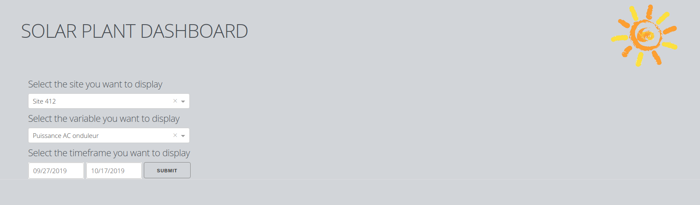
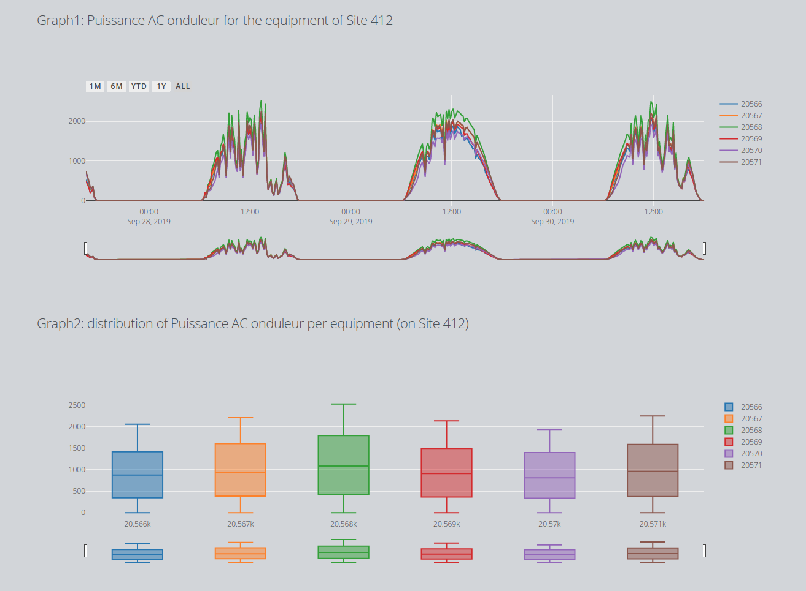

## Solar App
**Purpose**: Create a web application displaying data according to the user access rights.

## Requirements
* Admin users can see everything (client_id = 0)
* Non-admin users can only see their own sites (`user.client_id = site.client_id`)

## Database details
* Data is contained in the `measure` table, `value` column.
* `measure.equipment_id` links to `equipment.id_equipment`.
* `equipment.site_id` links to `site.id_site`.
* `measure.variable_id` links to `variable.id_variable`.
* `user.client_id` and `site.client_id` both link to `client.id_client`.

Note: the database has been reduce to 5 days of measurement history (from 25/09/2019 until 30/09/2019)

##Architecture
* auxilaries.py functions: get_name and build_options
* graph_layout.py: generic and specific layouts for graph
* html_components.py: build function for html bricks: banner, menu, graphs
* loading_data.py: loading data functions from database
* server.py: core of the dash app: css links, app layout, callbacks
* main.py: running file

## Features
The app upload data from sqlite_demo_wpo.db according to the selected site and variable.

* Selection menu: site, variable and timeframe selection

* Graph1 (line plot): displayed graphs

